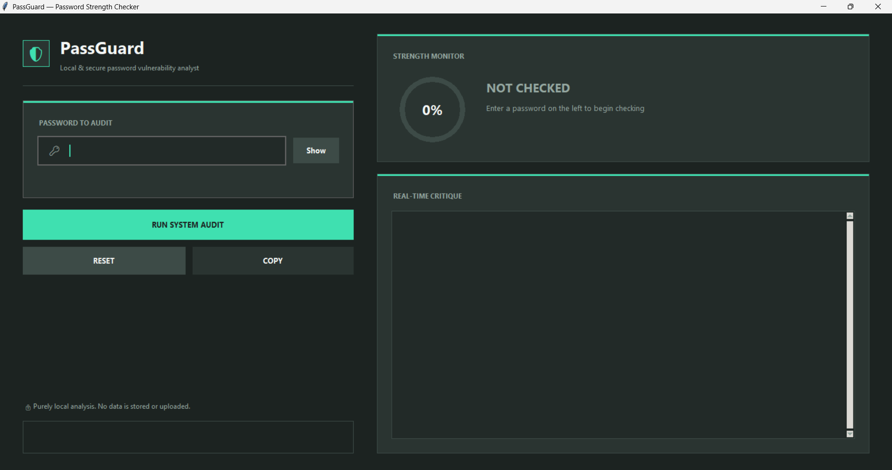

# 🔐 Password Strength Checker

### *Know your password strength in seconds*

## 🎯 About

A sleek, real-time **Password Strength Checker** built with Python and Tkinter. Enter any password and instantly know how secure it is — with visual feedback, improvement suggestions, and leaked password detection.

## 🖥️ Screenshots

<div align="center">



*"Know your password strength in real-time with visual feedback"*

</div>

---


## ✨ Features

- 🔍 Check password strength (Weak / Moderate / Strong)
- 📊 Circular progress bar with percentage
- 💡 Real-time improvement suggestions
- 🔒 Leaked password detection
- 👁️ Show / Hide password
- 📋 Copy to clipboard

## 🛠️ Tech Stack

**Python** • **Tkinter** • **HMAC**

## 🔒 Security

- Timing attack protection (`hmac.compare_digest`)
- Password cleared from memory after use
- Checks against 100+ leaked passwords

## 🚀 Quick Start

```bash
# Clone the repo
git clone https://github.com/your-username/password-strength-checker.git

# Go to folder
cd password-strength-checker


# Run the app
python main.py
```
## 👩‍💻 Author

**Mahnoor Shuaib**


## ⭐ Star this repo if you like it!

*Made with ❤️*

> *"A strong password is your first line of defense — make it count!"*

